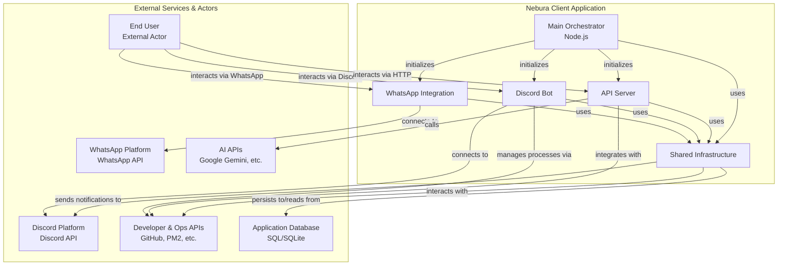

# Nebura Works

**Nebura Works** is a modular API platform that integrates multiple services such as Discord, WhatsApp, GitHub, Google AI, and more. This project is designed for extensibility, real-time communication, and robust monitoring, making it suitable for modern multi-service applications.

[](https://github.com/Hiroshi025/Nebura-AI)
[](https://github.com/Hiroshi025/Nebura-AI/issues)
[](LICENSE)
[](https://help.hiroshi-dev.me/)

---

## Table of Contents

- [Project Overview](#project-overview)
- [Architecture](#architecture)
- [Modules](#modules)
  - [API Server](#api-server)
  - [Discord Module](#discord-module)
  - [WhatsApp Module](#whatsapp-module)
- [Configuration](#configuration)
- [Usage Examples](#usage-examples)
- [Development & Scripts](#development--scripts)
- [Contributing](#contributing)
- [Support & Links](#support--links)
- [About the Creator](#about-the-creator)

---

## Project Overview

Nebura Works is a TypeScript-based, modular API platform that enables seamless integration of various services. It leverages Express, Socket.IO, Prisma ORM, and other modern libraries to provide a scalable and maintainable backend for bots, automation, and real-time applications.

**Key Features:**

- Modular architecture for Discord, WhatsApp, and more.
- Real-time communication via WebSockets.
- Robust logging, metrics, and monitoring.
- Automated backups and scheduled tasks.
- Multi-language support with i18next.
- Secure session and rate limiting.
- Extensible command and event system for Discord.

---

## Architecture

The core of Nebura Works is orchestrated by the `Engine` class (`src/main.ts`), which initializes and manages all modules:

- **API Server** (`src/server/index.ts`): Express-based HTTP server with Socket.IO, Swagger docs, security, and metrics.
- **Discord Module** (`src/modules/discord/client.ts`): Advanced Discord bot client with dynamic command loading, event handling, and modularity.
- **WhatsApp Module** (`src/modules/whatsapp/index.ts`): WhatsApp Web.js client with Excel-based logging, status reporting, and scheduled backups.
- **Database**: Managed via Prisma ORM, supporting upserts and advanced queries.
- **Monitoring**: (Optional) Sentry integration for error tracking.

### High-Level Diagram



---

## Modules

### API Server

- **File:** `src/server/index.ts`
- **Stack:** Express, Socket.IO, Swagger, Helmet, Apicache, i18next, session management.
- **Features:**
  - Middleware for security, caching, metrics, and localization.
  - Swagger UI for API documentation.
  - Real-time WebSocket support.
  - Static file serving for documentation and assets.
  - IP blocking and rate limiting.
  - Request/response tracing with unique IDs and response times.

#### Example: Starting the API Server

```typescript
import { API } from "./server";
const api = new API();
api.start();
```

### Discord Module

- **File:** `src/modules/discord/client.ts`
- **Stack:** discord.js, dynamic command/event/component loading.
- **Features:**
  - Advanced caching and sweeping strategies.
  - Dynamic loading and hot-reloading of commands, buttons, modals, and menus.
  - Alias management and recursive file discovery.
  - Emoji management (server and fallback).
  - Error handling and logging.

#### Example: Reloading a Command

```typescript
await client.reloadCommand("ping");
```

#### Example: Loading All Commands

```typescript
await client.loadCommands();
```

### WhatsApp Module

- **File:** `src/modules/whatsapp/index.ts`
- **Stack:** whatsapp-web.js, ExcelJS, qrcode-terminal.
- **Features:**
  - Logs all incoming messages to daily Excel files.
  - `/status` command for runtime statistics (uptime, unread messages, backup info).
  - Scheduled daily Excel backups with chat statistics.
  - QR code authentication and session management.
  - Robust error handling and logging.

#### Example: WhatsApp Status Command

Send `/status` from the bot's own number to receive a detailed status report.

---

## Configuration

Configuration is managed via environment variables and the `config` object.

- **Database:** Set `DATABASE_URL` in your environment.
- **Discord:** Provide `token`, `clientId`, `clientSecret`, and `owners` in the config.
- **WhatsApp:** Enable/disable via `modules.whatsapp.enabled`.
- **Backups:** Set `CRON_BACKUPS_TIME` for scheduled backups.
- **Sentry:** (Optional) Configure Sentry DSN and environment.

See [`package.json`](./package.json) for scripts and dependencies.

---

## Usage Examples

### Starting the Application

```bash
npm install
npm run build
npm start
```

### Development Mode

```bash
npm run start:dev
```

### Linting and Formatting

```bash
npm run lint
npm run lint:fix
npm run type-check
```

### Running Tests

```bash
npm test
```

---

## Development & Scripts

- **Build:** `npm run build`
- **Start:** `npm start`
- **Dev Mode:** `npm run start:dev`
- **Lint:** `npm run lint`
- **Type Check:** `npm run type-check`
- **Docs:** `npm run docs`
- **Release:** `npm run release`
- **Prepare:** `npm run prepare` (husky hooks)

See all scripts in [`package.json`](./package.json).

---

## Contributing

Contributions are welcome! Please open issues or pull requests on [GitHub](https://github.com/Hiroshi025/Nebura-AI).

- [Issue Tracker](https://github.com/Hiroshi025/Nebura-AI/issues)
- [Contributing Guide](https://github.com/Hiroshi025/Nebura-AI/blob/main/CONTRIBUTING.md)

---

## Support & Links

- **Homepage:** [https://help.hiroshi-dev.me/](https://help.hiroshi-dev.me/)
- **GitHub:** [https://github.com/Hiroshi025/Nebura-AI](https://github.com/Hiroshi025/Nebura-AI)
- **Report Bugs:** [GitHub Issues](https://github.com/Hiroshi025/Nebura-AI/issues)
- **Documentation:** [Swagger UI](http://localhost:PORT/docs) (after running the server)
- **Discord.js Docs:** [https://discord.js.org/#/docs](https://discord.js.org/#/docs)
- **WhatsApp Web.js Docs:** [https://wwebjs.dev/guide/](https://wwebjs.dev/guide/)
- **Prisma Docs:** [https://www.prisma.io/docs/](https://www.prisma.io/docs/)
- **Express Docs:** [https://expressjs.com/](https://expressjs.com/)

---

## About the Creator

**Nebura Works** is developed and maintained by [Hiroshi025](https://github.com/Hiroshi025).

> _"My mission is to build robust, scalable, and modular platforms that empower developers to integrate and automate across multiple services with ease. If you have questions, suggestions, or want to contribute, feel free to reach out via GitHub or the help center!"_

- **GitHub:** [Hiroshi025](https://github.com/Hiroshi025)
- **Sponsor:** [GitHub Sponsors](https://github.com/sponsors/tu-usuario)
- **Contact:** [Open an Issue](https://github.com/Hiroshi025/Nebura-AI/issues) or [Help Center](https://help.hiroshi-dev.me/)

---

_This project is licensed under the ISC License. See the [LICENSE](./LICENSE) file for details._
