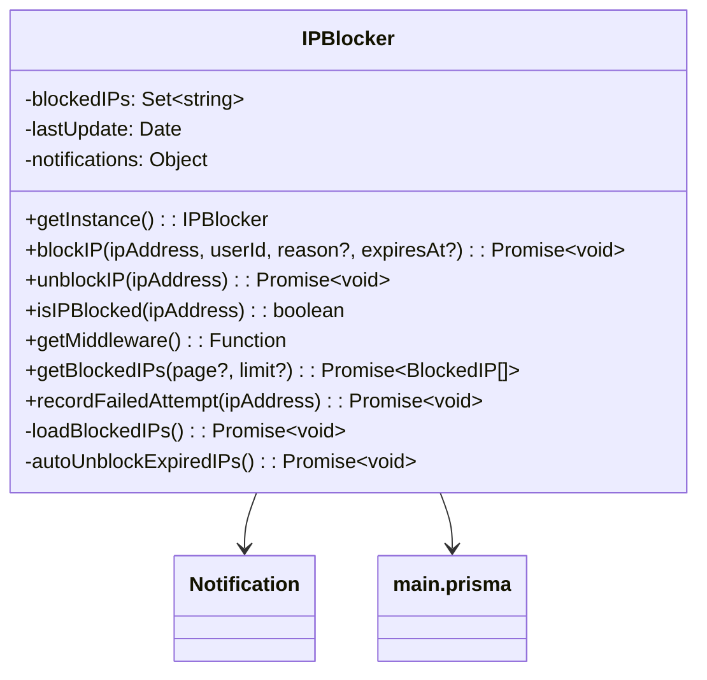

# IP Administrator


Los idiomas de la documentacion son principalmente ingles para evitar errores de sintaxis dentro de los proyectos como la documentacion


### Overview

The `IPBlocker` class is a singleton that manages IP address blocking functionality for an Express.js application. It provides:

* IP blocking and unblocking
* Automatic expiration of blocks
* Failed attempt tracking
* Webhook notifications
* Middleware for request blocking

### Class Diagram



### Configuration

The class uses configuration from `config.moderation.notifications`:

```javascript
{
  notifications: {
    webhooks: {
      token: "YOUR_WEBHOOK_TOKEN", // Required for notifications
      url: "WEBHOOK_URL"
    }
  }
}
```

### Methods

#### `getInstance()`

Retrieves the singleton instance of IPBlocker.

**Returns:** `IPBlocker` - The singleton instance

**Example:**

```javascript
const ipBlocker = IPBlocker.getInstance();
```

***

#### `blockIP(ipAddress, userId, reason?, expiresAt?)`

Blocks an IP address with optional reason and expiration.

| Parameter | Type      | Description                     |
| --------- | --------- | ------------------------------- |
| ipAddress | `string`  | IP address to block             |
| userId    | `string`  | ID of user performing the block |
| reason    | `string?` | Reason for blocking (optional)  |
| expiresAt | `Date?`   | Expiration date (optional)      |

**Database Schema:**

```javascript
{
  ipAddress: String,
  reason: String?,
  blockedBy: String,
  expiresAt: DateTime?,
  isActive: Boolean,
  blockedLicenseId: String
}
```

**Notification Payload:**

```javascript
{
  title: "IP Blocked",
  description: `The IP address ${ipAddress} has been blocked.`,
  color: "#FF0000",
  fields: [
    { name: "Blocked By", value: userId, inline: true },
    { name: "Reason", value: reason || "Not specified", inline: true },
    { name: "Expires At", value: expiresAt?.toISOString() || "Indefinite", inline: true }
  ]
}
```

***

#### `unblockIP(ipAddress)`

Unblocks an IP address.

| Parameter | Type     | Description           |
| --------- | -------- | --------------------- |
| ipAddress | `string` | IP address to unblock |

**Notification Payload:**

```javascript
{
  title: "IP Unblocked",
  description: `The IP address ${ipAddress} has been unblocked.`,
  color: "#00FF00",
  fields: [
    { name: "IP Address", value: ipAddress, inline: true }
  ]
}
```

***

#### `isIPBlocked(ipAddress)`

Checks if an IP address is blocked.

| Parameter | Type     | Description         |
| --------- | -------- | ------------------- |
| ipAddress | `string` | IP address to check |

**Returns:** `boolean` - True if blocked

***

#### `getMiddleware()`

Returns Express middleware to block requests from blocked IPs.

**Middleware Response (403):**

```json
{
  "error": "Access denied",
  "reason": "Your IP address has been blocked"
}
```

***

#### `getBlockedIPs(page?, limit?)`

Gets paginated list of blocked IPs.

| Parameter | Type     | Default | Description    |
| --------- | -------- | ------- | -------------- |
| page      | `number` | 1       | Page number    |
| limit     | `number` | 20      | Items per page |

**Returns:** `Promise<BlockedIP[]>` - Array of blocked IP records

***

#### `recordFailedAttempt(ipAddress)`

Records a failed attempt and automatically blocks after 5 attempts in 24 hours.

| Parameter | Type     | Description                  |
| --------- | -------- | ---------------------------- |
| ipAddress | `string` | IP address of failed attempt |

**Automatic Block Criteria:**

* 5+ failed attempts within 24 hours
* 24 hour block duration

**Notification Payload:**

```javascript
{
  title: "Automatic IP Block",
  description: `The IP address ${ipAddress} has been automatically blocked...`,
  color: "#FFA500",
  fields: [
    { name: "IP Address", value: ipAddress, inline: true },
    { name: "Reason", value: "Multiple failed attempts", inline: true },
    { name: "Blocked Duration", value: "24 hours", inline: true }
  ]
}
```

### Internal Methods

#### `loadBlockedIPs()`

Loads active blocked IPs from database into memory. Runs:

* On initialization
* Every hour (scheduled)

***

#### `autoUnblockExpiredIPs()`

Automatically unblocks IPs with expired blocks. Runs every 10 minutes.

### API Examples

#### Block IP

```javascript
await ipBlocker.blockIP(
  "192.168.1.1", 
  "user123", 
  "Repeated violations", 
  new Date(Date.now() + 86400000) // 24 hours
);
```

#### Get Blocked IPs

```javascript
const blockedIPs = await ipBlocker.getBlockedIPs(1, 10);
```

#### Middleware Usage

```javascript
app.use(ipBlocker.getMiddleware());
```

### Error Handling

All methods include try-catch blocks and log errors using:

```javascript
logWithLabel("api", `[IPBlocker] Error message`);
```

### Monitoring

The system logs key events:

* IP blocks/unblocks
* Failed attempts
* Automatic blocks
* Memory loading status

Example log:

```
[IPBlocker] 15 IPs is blocked and loaded in memory.
  🔹   Last update: 2023-05-15T12:34:56.789Z
```
