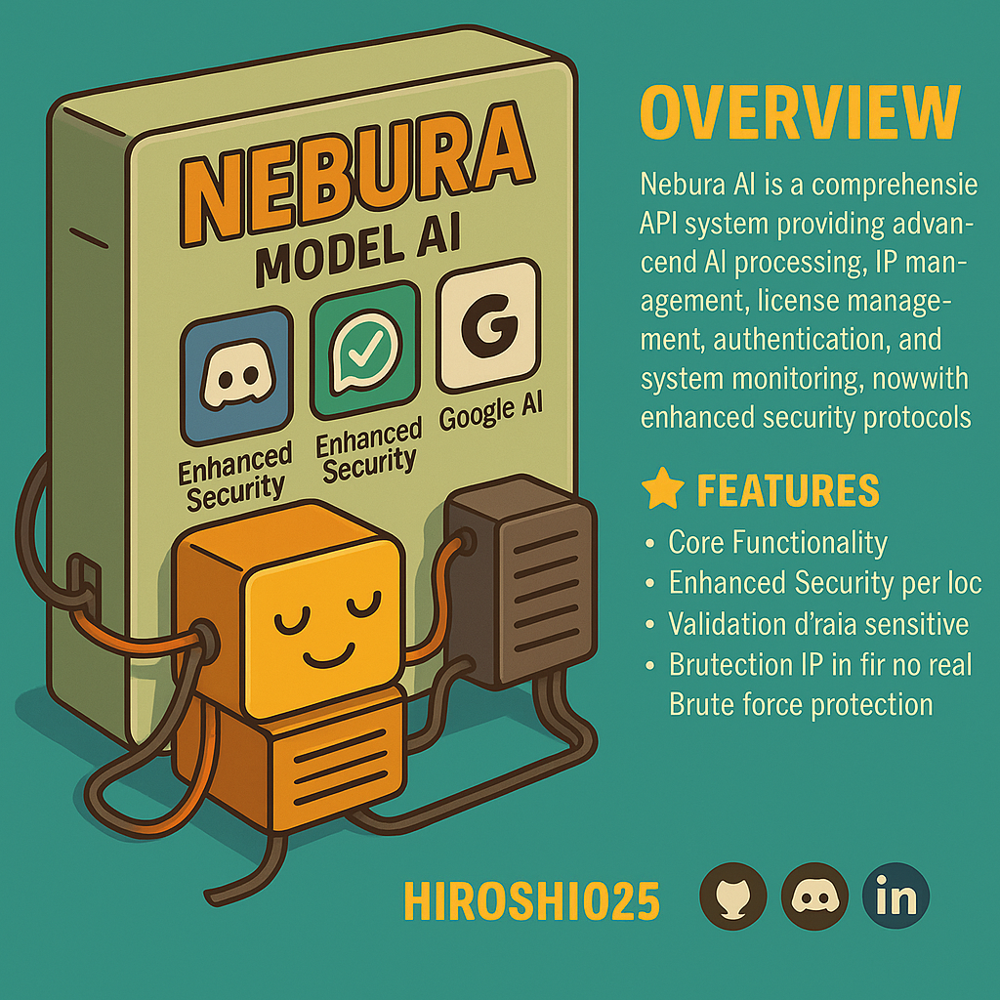

# Discord Client

<figure><figcaption></figcaption></figure>

## Contenido

1. Sistema de Log con Configuración por Medio de Menú
2. Sistema de economía completo con juegos para una interacción mas completa con los usuarios:&#x20;
   * Economía por Servidor
   * Juegos Interactivos como rps, duelos, ruleta, tienda personalizada, maquina y apuesta
   * Tablas de los 15 mejores y 3 primeros puestos
   * Consumo y Venta de ítems de la tienda


La economía se somete a actualizaciones seguidas por lo que se abren issue y canales de sugerencia para estas dinámicas

