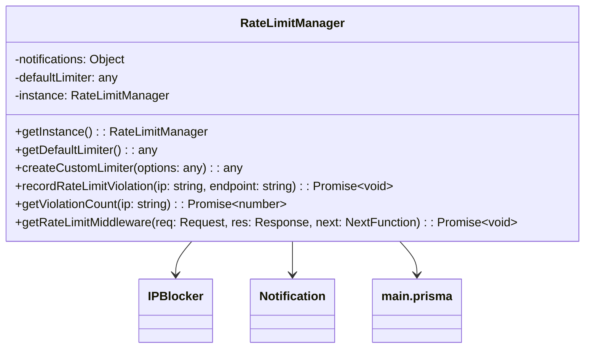

# RateLimit


Los idiomas de la documentacion son principalmente ingles para evitar errores de sintaxis dentro de los proyectos como la documentacion


### Overview

The `RateLimitManager` class is a singleton that handles rate limiting and IP blocking functionality for an Express.js application. It provides:

* Default rate limiting configuration
* Custom rate limiter creation
* IP blocking for repeated violations
* Notification system for violations
* License-based rate limiting tiers

### Table of Contents

1. Class Diagram
2. Constructor
3. Methods
   * getInstance
   * getDefaultLimiter
   * createCustomLimiter
   * recordRateLimitViolation
   * getViolationCount
   * getRateLimitMiddleware
4. Configuration
5. Error Handling
6. API Examples

### Class Diagram



### Constructor

#### `private constructor()`

Initializes the RateLimitManager with default configuration.

| Parameter | Type | Description |
| --------- | ---- | ----------- |
| None      | -    | -           |

**Default Limiter Configuration:**

```javascript
{
  windowMs: 15 * 60 * 1000, // 15 minutes
  max: 100, // 100 requests per window
  standardHeaders: true,
  legacyHeaders: false,
  handler: async function(req, res) {
    // Handles rate limit violations
  }
}
```

### Methods

#### `getInstance()`

Retrieves the singleton instance of RateLimitManager.

**Returns:** `RateLimitManager` - The singleton instance

**Example:**

```javascript
const rateLimitManager = RateLimitManager.getInstance();
```

***

#### `getDefaultLimiter()`

Gets the default rate limiter middleware.

**Returns:** `any` - The default rate limiter middleware

**Example:**

```javascript
app.use(rateLimitManager.getDefaultLimiter());
```

***

#### `createCustomLimiter(options)`

Creates a custom rate limiter with specific options.

| Parameter | Type  | Description                                |
| --------- | ----- | ------------------------------------------ |
| options   | `any` | Configuration options for the rate limiter |

**Returns:** `any` - The custom rate limiter middleware

**Example Options:**

```javascript
{
  windowMs: 60 * 60 * 1000, // 1 hour
  max: 50,
  message: "Custom limit exceeded"
}
```

***

#### `recordRateLimitViolation(ip, endpoint)`

Records a rate limit violation in the database and sends notifications.

| Parameter | Type     | Description                           |
| --------- | -------- | ------------------------------------- |
| ip        | `string` | The IP address of the violator        |
| endpoint  | `string` | The endpoint where violation occurred |

**Returns:** `Promise<void>`

**Database Schema:**

```javascript
{
  ipAddress: String,
  endpoint: String,
  violationTime: DateTime
}
```

**Notification Payload:**

```javascript
{
  title: "Rate Limit Violation",
  description: `IP: ${ip} has exceeded the request limit on endpoint: ${endpoint}`,
  color: "#FF0000",
  fields: [
    { name: "IP Address", value: ip, inline: true },
    { name: "Endpoint", value: endpoint, inline: true },
    { name: "Time", value: ISOString, inline: true }
  ],
  options: {
    content: "🚨 Rate Limit Violation Alert",
    username: "Rate Limit Manager"
  }
}
```

***

#### `getViolationCount(ip)`

Retrieves the count of rate limit violations for an IP in last 24 hours.

| Parameter | Type     | Description             |
| --------- | -------- | ----------------------- |
| ip        | `string` | The IP address to check |

**Returns:** `Promise<number>` - Count of violations

**Critical Notification (≥3 violations):**

```javascript
{
  title: "Critical Rate Limit Violations",
  description: `IP: ${ip} has reached ${count} violations in the last 24 hours.`,
  color: "#FFA500",
  // ...similar fields as above
}
```

***

#### `getRateLimitMiddleware(req, res, next)`

Middleware that applies rate limiting based on license type or default settings.

| Parameter | Type           | Description              |
| --------- | -------------- | ------------------------ |
| req       | `Request`      | Express request object   |
| res       | `Response`     | Express response object  |
| next      | `NextFunction` | Next middleware function |

**License Tiers:**

| Tier    | Window | Max Requests | Message                                                      |
| ------- | ------ | ------------ | ------------------------------------------------------------ |
| FREE    | 15 min | 50           | "Free tier limit exceeded (50 requests per 15 minutes)"      |
| BASIC   | 15 min | 200          | "Basic tier limit exceeded (200 requests per 15 minutes)"    |
| PREMIUM | 15 min | 1000         | "Premium tier limit exceeded (1000 requests per 15 minutes)" |
| Default | 15 min | 100          | "You have exceeded the allowed request limit"                |

### Configuration

The class uses configuration from `config.moderation.notifications`:

```javascript
{
  notifications: {
    webhooks: {
      token: "YOUR_WEBHOOK_TOKEN", // Required for notifications
      url: "WEBHOOK_URL"
    }
  }
}
```

### Error Handling

All methods include try-catch blocks and log errors using:

```javascript
logWithLabel("error", "Error message");
```

### API Examples

#### Default Rate Limiter Response (429)

```json
{
  "success": false,
  "error": "Too many requests",
  "message": "You have exceeded the allowed request limit"
}
```

#### IP Blocked Response (403)

```json
{
  "success": false,
  "error": "Access denied",
  "message": "Your IP address has been blocked"
}
```

#### Rate Limit Violation Webhook Notification Example

```json
{
  "embeds": [
    {
      "title": "Rate Limit Violation",
      "description": "IP: 192.168.1.1 has exceeded the request limit on endpoint: /api/users",
      "color": 16711680,
      "fields": [
        {
          "name": "IP Address",
          "value": "192.168.1.1",
          "inline": true
        },
        {
          "name": "Endpoint",
          "value": "/api/users",
          "inline": true
        },
        {
          "name": "Time",
          "value": "2023-05-15T12:34:56.789Z",
          "inline": true
        }
      ],
      "footer": {
        "text": "Rate Limit Manager"
      }
    }
  ],
  "content": "🚨 Rate Limit Violation Alert",
  "username": "Rate Limit Manager"
}
```
