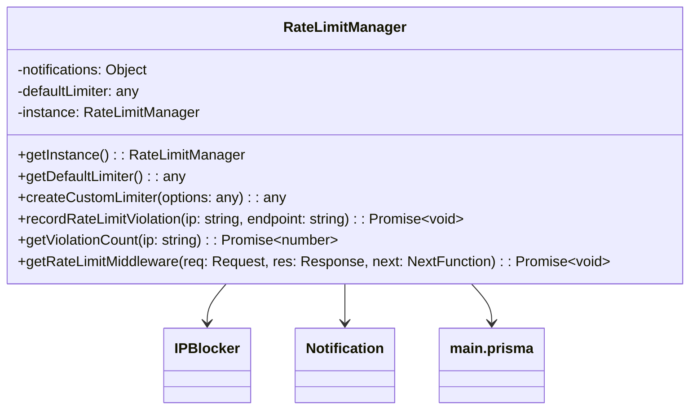

# RateLimit

### Visión General

La clase `RateLimitManager` es un singleton que maneja la limitación de tasa y el bloqueo de IPs para una aplicación Express.js. Proporciona:

* Configuración predeterminada de limitación de tasa
* Creación de limitadores personalizados
* Bloqueo de IPs por violaciones repetidas
* Sistema de notificaciones para violaciones
* Niveles de limitación basados en licencias

### Diagrama de Clase



### Constructor

`private constructor()`
\
Inicializa el RateLimitManager con configuración predeterminada.

**Configuración del Limitador Predeterminado:**

```javascript
{
  windowMs: 15 * 60 * 1000, // 15 minutos
  max: 100, // 100 peticiones por ventana
  standardHeaders: true,
  legacyHeaders: false,
  handler: async function(req, res) {
    // Maneja violaciones del límite de tasa
  }
}
```

### Métodos

#### getInstance()

Obtiene la instancia singleton de RateLimitManager.

**Retorna:** `RateLimitManager` - La instancia singleton

**Ejemplo:**

```javascript
const rateLimitManager = RateLimitManager.getInstance();
```

#### getDefaultLimiter()

Obtiene el middleware de limitación de tasa predeterminado.

**Retorna:** `any` - El middleware de limitación predeterminado

**Ejemplo:**

```javascript
app.use(rateLimitManager.getDefaultLimiter());
```

#### createCustomLimiter(options)

Crea un limitador de tasa personalizado con opciones específicas.

**Retorna:** `any` - El middleware de limitación personalizado

**Ejemplo de Opciones:**

```javascript
{
  windowMs: 60 * 60 * 1000, // 1 hora
  max: 50,
  message: "Límite personalizado excedido"
}
```

#### recordRateLimitViolation(ip, endpoint)

Registra una violación de límite de tasa en la base de datos y envía notificaciones.

**Retorna:** `Promise<void>`

**Esquema de Base de Datos:**

```javascript
{
  ipAddress: String,
  endpoint: String,
  violationTime: DateTime
}
```

**Carga de Notificación:**

```javascript
{
  title: "Violación de Límite de Tasa",
  description: `IP: ${ip} ha excedido el límite de peticiones en el endpoint: ${endpoint}`,
  color: "#FF0000",
  fields: [
    { name: "Dirección IP", value: ip, inline: true },
    { name: "Endpoint", value: endpoint, inline: true },
    { name: "Hora", value: ISOString, inline: true }
  ],
  options: {
    content: "🚨 Alerta de Violación de Límite de Tasa",
    username: "Gestor de Límites"
  }
}
```

#### getViolationCount(ip)

Obtiene el conteo de violaciones de límite de tasa para una IP en las últimas 24 horas.

**Retorna:** `Promise<number>` - Conteo de violaciones

**Notificación Crítica (≥3 violaciones):**

```javascript
{
  title: "Violaciones Críticas de Límite de Tasa",
  description: `IP: ${ip} ha alcanzado ${count} violaciones en las últimas 24 horas.`,
  color: "#FFA500",
  // ...campos similares a los anteriores
}
```

#### getRateLimitMiddleware(req, res, next)

Middleware que aplica limitación de tasa basada en tipo de licencia o configuración predeterminada.

**Niveles de Licencia:**
\
(Detalles de implementación específicos)

### Configuración

La clase usa configuración de `config.moderation.notifications`:

```javascript
{
  notifications: {
    webhooks: {
      token: "TOKEN_DE_TU_WEBHOOK", // Requerido para notificaciones
      url: "URL_WEBHOOK"
    }
  }
}
```

### Manejo de Errores

Todos los métodos incluyen bloques try-catch y registran errores usando:

```javascript
logWithLabel("error", "Mensaje de error");
```

### Ejemplos de API

#### Respuesta Predeterminada por Límite de Tasa (429)

```json
{
  "success": false,
  "error": "Demasiadas peticiones",
  "message": "Has excedido el límite de peticiones permitido"
}
```

#### Respuesta de IP Bloqueada (403)

```json
{
  "success": false,
  "error": "Acceso denegado",
  "message": "Tu dirección IP ha sido bloqueada"
}
```

#### Ejemplo de Notificación por Webhook

```json
{
  "embeds": [
    {
      "title": "Violación de Límite de Tasa",
      "description": "IP: 192.168.1.1 ha excedido el límite de peticiones en el endpoint: /api/users",
      "color": 16711680,
      "fields": [
        {
          "name": "Dirección IP",
          "value": "192.168.1.1",
          "inline": true
        },
        {
          "name": "Endpoint",
          "value": "/api/users",
          "inline": true
        },
        {
          "name": "Hora",
          "value": "2023-05-15T12:34:56.789Z",
          "inline": true
        }
      ],
      "footer": {
        "text": "Gestor de Límites"
      }
    }
  ],
  "content": "🚨 Alerta de Violación de Límite de Tasa",
  "username": "Gestor de Límites"
}
```
