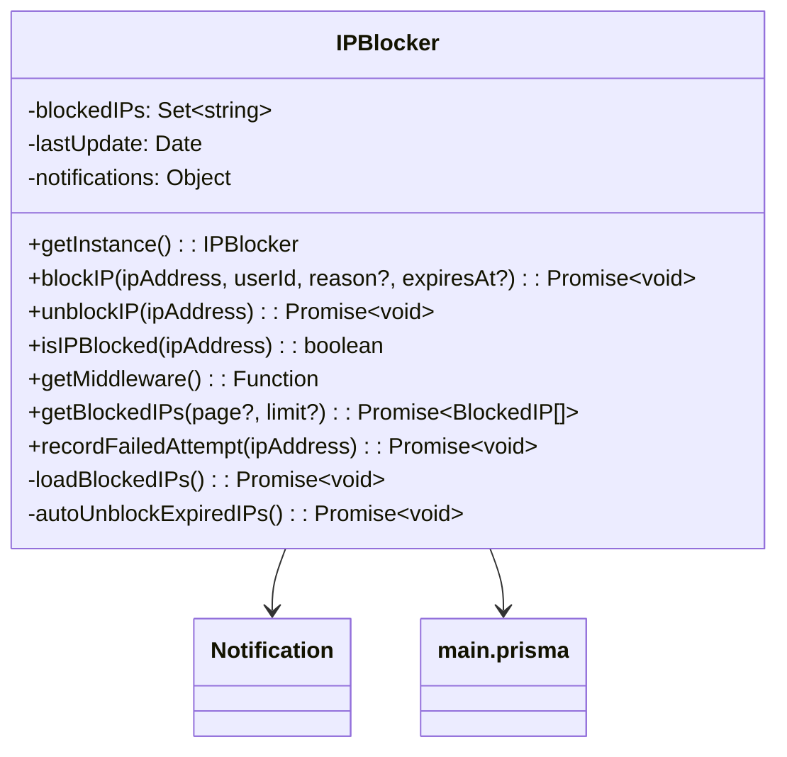

# IP Administrador

### Visión General

La clase `IPBlocker` es un singleton que gestiona el bloqueo de direcciones IP para una aplicación Express.js. Proporciona:

* Bloqueo y desbloqueo de IPs
* Expiración automática de bloqueos
* Seguimiento de intentos fallidos
* Notificaciones por webhook
* Middleware para bloquear peticiones

### Diagrama de Clase



### Configuración

La clase usa configuración de `config.moderation.notifications`:

```javascript
{
  notifications: {
    webhooks: {
      token: "TOKEN_DE_TU_WEBHOOK", // Requerido para notificaciones
      url: "URL_WEBHOOK"
    }
  }
}
```

### Métodos

#### getInstance()

Obtiene la instancia singleton de IPBlocker.

**Retorna:** `IPBlocker` - La instancia singleton

**Ejemplo:**

```javascript
const ipBlocker = IPBlocker.getInstance();
```

#### blockIP(ipAddress, userId, reason?, expiresAt?)

Bloquea una dirección IP con razón y expiración opcionales.

**Esquema de Base de Datos:**

```javascript
{
  ipAddress: String,
  reason: String?,
  blockedBy: String,
  expiresAt: DateTime?,
  isActive: Boolean,
  blockedLicenseId: String
}
```

**Carga de Notificación:**

```javascript
{
  title: "IP Bloqueada",
  description: `La dirección IP ${ipAddress} ha sido bloqueada.`,
  color: "#FF0000",
  fields: [
    { name: "Bloqueado Por", value: userId, inline: true },
    { name: "Razón", value: reason || "No especificada", inline: true },
    { name: "Expira En", value: expiresAt?.toISOString() || "Indefinido", inline: true }
  ]
}
```

#### unblockIP(ipAddress)

Desbloquea una dirección IP.

**Carga de Notificación:**

```javascript
{
  title: "IP Desbloqueada",
  description: `La dirección IP ${ipAddress} ha sido desbloqueada.`,
  color: "#00FF00",
  fields: [
    { name: "Dirección IP", value: ipAddress, inline: true }
  ]
}
```

#### isIPBlocked(ipAddress)

Verifica si una dirección IP está bloqueada.

**Retorna:** `boolean` - True si está bloqueada

#### getMiddleware()

Retorna middleware de Express para bloquear peticiones de IPs bloqueadas.

**Respuesta del Middleware (403):**

```json
{
  "error": "Acceso denegado",
  "reason": "Tu dirección IP ha sido bloqueada"
}
```

#### getBlockedIPs(page?, limit?)

Obtiene lista paginada de IPs bloqueadas.

**Retorna:** `Promise<BlockedIP[]>` - Array de registros de IPs bloqueadas

#### recordFailedAttempt(ipAddress)

Registra un intento fallido y bloquea automáticamente después de 5 intentos en 24 horas.

**Criterios de Bloqueo Automático:**

* 5+ intentos fallidos en 24 horas
* Duración de bloqueo: 24 horas

**Carga de Notificación:**

```javascript
{
  title: "Bloqueo Automático de IP",
  description: `La dirección IP ${ipAddress} ha sido bloqueada automáticamente...`,
  color: "#FFA500",
  fields: [
    { name: "Dirección IP", value: ipAddress, inline: true },
    { name: "Razón", value: "Múltiples intentos fallidos", inline: true },
    { name: "Duración del Bloqueo", value: "24 horas", inline: true }
  ]
}
```

### Métodos Internos

#### loadBlockedIPs()

Carga IPs bloqueadas activas desde la base de datos a memoria. Se ejecuta:

* Al inicializar
* Cada hora (programado)

#### autoUnblockExpiredIPs()

Desbloquea automáticamente IPs con bloqueos expirados. Se ejecuta cada 10 minutos.

### Ejemplos de API

#### Bloquear IP

```javascript
await ipBlocker.blockIP(
  "192.168.1.1", 
  "usuario123", 
  "Violaciones repetidas", 
  new Date(Date.now() + 86400000) // 24 horas
);
```

#### Obtener IPs Bloqueadas

```javascript
const blockedIPs = await ipBlocker.getBlockedIPs(1, 10);
```

#### Uso del Middleware

```javascript
app.use(ipBlocker.getMiddleware());
```

### Manejo de Errores

Todos los métodos incluyen bloques try-catch y registran errores usando:

```javascript
logWithLabel("api", `[IPBlocker] Mensaje de error`);
```

### Monitoreo

El sistema registra eventos clave:

* Bloqueos/desbloqueos de IPs
* Intentos fallidos
* Bloqueos automáticos
* Estado de carga en memoria

**Ejemplo de registro:**

```
[IPBlocker] 15 IPs están bloqueadas y cargadas en memoria.
  🔹   Última actualización: 2023-05-15T12:34:56.789Z
```
